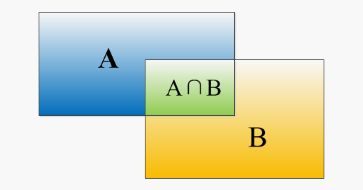
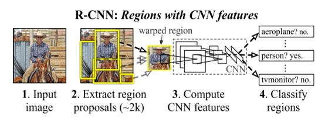
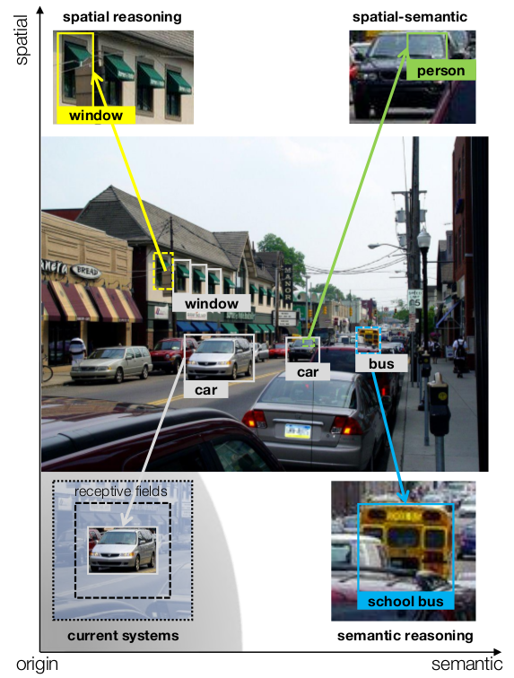

# Object Detection Papers

Invoker 录, 2018.04.18

原文：[深度学习之目标检测网络学习总结](https://zhuanlan.zhihu.com/p/35724768)

可以主要分为两类：One-Stage, Two-Stage. 前者把候选框生成和识别框内物体两个过程统一在一起，直接检测结果，主要包括：SSD, YOLO系列。后者主要包括：R-CNN, SPP Net, Fast R-CNN, Faster R-CNN, R-FCN, FPN, 然后是集大成者Mask R-CNN.

## 预备知识

* IOU

则IOU计算为：

$$IOU = \frac{A \cap B}{A \cup B}$$

* 非极大值抑制

  这是一个迭代-遍历-消除的过程。第一步，对所有的框按照置信度进行排序，从低到高放在一个列表里面，从列表里面取出当前置信度最高的框，作为目标，把还在列表内的框进行比较，如果重合度大于阈值，就将框从列表中去除，遍历整个列表。然后去除当前置信度最高的，重复上述操作，直到这个列表最终变空。

  所以也就是说，会选出很多个框，且这些剩下的框之间的重合度小于阈值。

- - - - - -

Two Stage.

## RCNN

### 主要步骤1

* Takes an input image

* Extracts around 2000 bottom-up rgion proposals

* Computes features for each proposals with a large CNN

* classifies each region using class-specific linear SVMs

### 来自论文的内容

* Object Localization

  * Regression Problem

  * Slding window detector with CNN

    We solve the CNN locatization problem by operating within the "recognition using regions" paradigm.

* Labeled data is scarce and insufficient for training a large CNN.

  * 传统做法

    无监督与训练 + Fine Tuning

  * 文章的做法

    有监督训练(ILSVRC) + Domain-specific Fine Tuning(PASCAL)

* Bounding-box regressioin method significantly reduces mislocalizations, which are the dominant error mode.

* 系统结构

  * Category-independent region proposals

    * Objectness

    * *Selective Search*

      *Selective search for object recogniton, IJCV,2013*

    * *Category-independent object proposals*

      *Category independent object proposals, ECCV,2010*

    * Constrained parametric min-cuts (CPMC)

    * Multi-scale combinational grouping

    * Ciresan

    **We run selective search on the test image to extract around 2000 region proposals(use selective search's 'fast mode' in all experiments).**

  * Large CNN extracts a fixed-length feature vector from each region

    Extract 4096-dimensional feature vector from each proposal, using AlexNet.

    Warp all pixels in a tight bounding box around it to the required size (227 * 227).

    All CNN parameters are shared across all categories.

  * Linear SVMs

    The dot products between features and SVM weights. All dot products for an image are batched into a single matrix-matrix product. the feature matrix is typically 2000 $*$ 4096, and the SVM weight matrix is 2096 $*$ N, where N is the number of classes.

* Training

  * Supervised pre-training.

  * Domain-specific fine-tuning.

    Treat all region proposal with $\ge 0.5$ IoU overlap with ground-truth box as positives.

    SGD at a learning rate: 0.001;

    In each SGD iteration, we uniformly sample 32 positive windows and 96 background windws to construct a mini-batch of size 128. We bias the sampling towards positive windows because they are extremely rare compared to background.

    Since the training data is too large to fit in memory, **Standard Hard negative mining method**.(*Object detection with discriminatively trained part based models, TPAMI 2010. & Technical Report A.I. Memo No.1521, MIT1994*)

* Ablation

  * Fine-tuning

    The pool5 features learned from ImageNet are general and that most of the improvement is gained from learning domain-specific non-linear classifiers on top of them, i.e. the full-connected layers.

  * Network Architectures

    The architecture of Net has a large effect on R-CNN detection performance.

    VGG. AlexNet.

  * Bounding box regression

    Implements a simple method to reduce localization errors.

    Train a linear regression model to predict a new detection window given the pool5 features for a selective search region proposal.

* Appendix

  * Object proposal transformation

    Object proposals are arbitrary image rectangles. Evaluated two ways to transfrom object proposals to valid CNN inputs.

    * Tightest square with context.

      Encloses each object proposal inside the tightest square and then scale the image contained in that square to the CNN input size.

      Tightest square without context:

      Excludes the image content that surrounds the original object proposal.

    * Warp

      Anisotropically(各向异性地) scales each object proposal to the CNN input size.

  * Positive vs. Negative examples and softmax

  * Bounding-box regression

    After scoring each selective search proposal with a class-specific detection SVM, we predict a new bounding box for the detection using a **class-specific** bounding-box regressor.

    Here, we regress from features computed by the CNN, rather than from geometric features  computed on the inferred DPM part locations.

    The transformation in terms of four functions:

### 来自知乎的内容

* Selective Search算法

## SPP Net

## Fast RCNN

## Faster RCNN

## R-FCN

## FPN

## Mask RCNN

- - - - - -

One Stage.

## YOLO

## YOLO v2

## YOLO v3

## SSD

- - - - - -

Other  Approaches

## Iterative Visual Reasoning Beyond Convolutions

IVRBC, Li Fei-fei, 2018.04

### Abstract IVRBC

Two core modules:

* A local module that uses spatial memory, to store previous beliefs with parallel updates.

* A global graph-reasoning module.

Components of Global Graph-Reasonging module:

* A Knowledge graph

  classes as nodes and build edges to encode different types of semantic relationships between them.

* A Region Graph

  Regions in the image are nodes and spatial relationships between these regions are edges

* An Assignment Graph

  assigns regions to classes.

**The final predictions are made by combining the best of both modules with an attention mechanism.**

### Introduction IVRBC

A key recipe to reasoning with relationships is to *iteratively* build up estimates.

A lot of semantic reasoning requires learning from few or no examples. Therefore, we need ways to exploit additional structured information for visual reasoning.

Local and Global reasoning are not isolated: a good image understanding is usually a compromise between background knowledge learned a *priori* and image-specific observations.

### Related work IVRBC

* Visual Knowledge Base

  Accumulate structured knowledge (*e.g.* relationships, n-grams) automatically from the web.

  Visual knowledge has been applied to end tasks, such as affordances, Image classification, or questioni answering.

* Context Modeling

  ConvNets are extremely effective in aggregating local pixel-to-pixel context through its ever-growing receptive fields.

  Previous work: scene-level reasoning, attributes, structured prediction, relationship graph.

* Relational Reasoning

  Symbolic approaches, the relationship is defined by the language of mathematics and logic, and reasoning takes place by deduction, abduction.

  Path ranking algorithm.

### Reasoning Framework

总体结构

* Reasoning with Convolutions

  Local Modules. Use a spatial memory $S$ to store previously detected objects at the very location they have been found. $S$ is a tensor with three dimensions. The first tow, H & W, correspond to the reduced size of the image, the third one, depth D(=512) makes each cell of the memory $c$ a vector that stores potentially useful information at that location.

  Convolutional Gated Recurrent Unit.

* Beyond Convolutions

  Global Modules.

  * Spartial Global

    far regions communicate information with each other, not confined by the receptive fields of the reasoning module.

  * Semantic Global

    Take advantage of visual knowledge bases.

    More about the Graph can be found in 3.2 section of this paper.

    * For spartial region relation, edge weights are defined by measuring the pixel-level distances between the two.

    * For edges between regions and classes. Propagating beliefs from region to class or backwards.

    * Semantic relationships. Edges between classes.

      From knowledge bases.

    * Graph-based reasoning module $R$.

      For *spatial* path:

      $$G_r^{spatial} = \sum_{e \in \epsilon_{r \rightarrow r}} A_eM_rW_e$$

      where, $A_e \in R^{r * r}$ is the adjacency matrix of edge type $e$, $W_e$ is weight.

      For *semantic* path:

      省略...

      For *output* for regions $G_r$ are computed by merging these two paths:

      $$G_r = \sigma(G_r^{spatial} + \sigma(A_{e_{c \rightarrow r}}G_c^{semantic}W_e))$$

      which propagates semantic information back to regions, and then applies non-linear activation.

      We use three stacks of operations with residual connections, before the output is fed to predict.

  * Iterative Reasoning

    A key ingredient of reasoning is to iteratively build up estimates.

    GRU is used to concatenate together local and global features to update Memories.

  * Attention

    Instead of only generating scores $f$, the model also has to produce an 'Attention' value $a$ that denotes the relative confidence of the current prediction compared to the ones from other iterations or modules.

  * Traning

    Loss function consists of:

    * plain ConvNet loss $L_0$

    * Local module loss $L_i^l$

    * global module loss $L_i^g$

    * final prediction loss with attentions $L_f$

    To focus more on the harder examples, we propose to simply re-weight the examples in the loss, based on predictioins from previous iterations.

### Experiments IVRBC

* Datasets

  ADE, Visual Genome(VG)

  For ADE, five types of edges between classes:

  * is part of

  * is kind of

  * plural form

  * horizontal symmetry

  * similarity

  前四个是有向边.

  For VG, select the top 10 most frequent relationships to automatically construct edges beyond commonsense relatiohsips constructed for ADE.

* Tasks & Evaluations

  For evaluation, we use classification accuracy (AC) and average precision (AP).

* Implementation Details

  *tf-faster-rcnn* is used to implement our baseline for region classification, with region proposal branch and bounding box regression compoenents removed.

  *ResNet-50* pre-trained on ImageNet is used as our backbone image classifier.

  BN parameters are fixed.

  Use the last *conv4* layer as our mid-level features to feed the spatial memory $S$.

  Use the *conv5* layer after avg-pool for the global module, mid-level features.

  Word vectors from fastText are used to represent each class.

  ReLU is selected as the activation function.

  SGD with Momentum to optimize all the models, and use the validation set to tune hyper-parameters.

* Analysis

  Re-weighting hard examples helps around 0.5% regradless of reasoning modules.

  Spatial memory $S$ is critical in the local module. Local context aggregator $C$ is less influential for ADE.

  For global module, different story takes place.

  Removing cross-feeding and dropping the number of iterations both result in worse performance.

### Conclusion IVRBC

We presented a novel framework for iterative visual reasoning. Beyond ConvNets, it uses a graph to encode spatial and semantic relationships between regions and classes and passes message on the graph.

Achieving an 8.4% absolute gain on ADE and 3.7% on COCO.

Analysis also shows that our reasoning framework is resilient to missing regions caused by current region proposal approaches.

## Efficient Graph-Based Image Segmentation

### Abstract 100

We define a predicate for measuring the evidence for a boundary between two regions using a **graph-based representation** of the image.

### Introduction 100

Perceptual grouping plays a powerful role in human visual preception.

Higher-level problems such as recognition and image indexing can also make use of segmentation results in matching, to address problems such as fiture-gournd separation and recognition by parts.

Our method is based on selecting edges from a graph, where each pixel correpsonds to a node in the graph, and certain neighboring pixels are connected by undirected edges. Weights on each edge measure the dissimilarity between pixels.

Adjusts the segmentation criterion based on the degree of variability in neighbouring regions of the image.

Non-local image characteristics.

### Related Work 100

Graph-based:

$$G = (V, E)$$

A weight is associated with each edge based on some property of the pixels that it connects, such as their image intensities.

* Simply breaking large weight edges would either result in the high variability region being split into multiple regions, or would merge the ramp and the constant region together.

* Normalizing the weight of an edge using the smallest weight incident on the vertices touching that edge.

* Splitting and merging regions according to how well each region fits some **uniformity criterion**.

* Finding compact clusters in some feature space

* Finding minimum cuts in a graph, where the cut criterion is designed in order to minimize the similarity between pixels that are being split.

* Eigenvector-based approximations to nomalized cut criterion

### Graph-Based Segmentation

* Undirected Graph, edges corresponds to pairs of neighboring vertices. Weights of each edge is a non-negative measuer of the dissimilarity between neighboring elements.

* edges between vertices in the same component should have relatively low weights, and in different components should have higher weights.

* Pairewise region comparison predicate

  * Internal difference

    The largest weight in the minimum spanning tree of the component.

  * Difference between two components

    The minimum weight edge commnecting the two components.

  A small change to the segmentation criterion vastly changes the difficulty of the problem.

  * A threshold function is used to control the degree to which the difference between components must be larger than minimum internal difference. The threshold is based on the size of the component:

  $$\tau = k / |C|$$

  $k$ is some constant parameter.

### The algorithm and its properties
