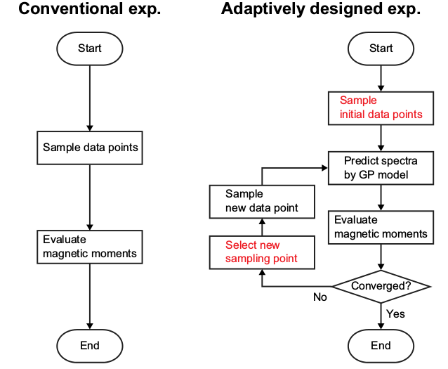

# Papers Report: ZSL + ML in Material Analysis

由于对材料相关的知识了解不多，所以在对论文进行报告的时候，主要关注数据的处理方式：包括材料分析中产生的数据的格式、在应用机器学习算法之前如何对数据进行处理、用到的机器学习算法、数据的处理结果如何。至于产生数据的材料学分析原理在这里被省略，而主要关注数据的输入**格式**。

## 背景

1. 光谱分析

2. 材料的相变(Phase transitions)

## Machine learning-enabled identification of matrial phase transitions

### Abstract

利用机器学习来确定铁电体中的相变(Phase transitions)，提供通用的、统计学上显著的、鲁棒途径，来确定临界状态(Critical regimes)以及相界的存在(Phase Boundaries)。

Temperature-bias phase diagram

### Conclude

结果表明，机器学习可以在缺少先验知识(Priori Knowledge)下，仅利用结构相位(Structural Phases)变化的局部信息，即可得到相位图(Phase Diagram)。

利用无监督学习对实验数据进行处理，生成相位图。

文中给出的途径，可以用于用于纳米尺寸的相位图的生成。

### 涉及到的算法

* 主成分分析(PCA)

    主要用于去噪、降维等。

    利用PCA对数据$A=A([x, y, T], t)$, 其中，A是PFM信号的幅度，$t$表示时间，$T$是温度。

    利用奇异值分解(SVD)得到特征向量与特征值。

* 聚类

    主成份分析具有缺点：没有具体含义、在辨别相位的时候无法捕获细小结构的相位变化情况。

    具体算法：K-means

    Perform K-means clustering on the entire relaxation data for all voltage pulses at all temperatures.

### 数据格式

- - - - - -

## Adaptive design of an X-ray magnetic circular dichroism spectroscopy experiment with Gaussian process modelling

### 2-Abstract

利用机器学习完成光谱分析，文中主要利用XMCD(X-ray magnetic circular dichroism)这种技术产生光谱数据，然后利用机器学习对其分析。

#### 背景：

利用XMCD定量评估材料的轨道(Orbital)和自旋磁矩(Magnetic Moments)。

利用Guassian Process完成光谱预测(Spectrum predictor).

The XMCD spectrum is predicted by Gaussian process modelling with learning of an experimental spectrum.

Magnetic moments can be evaluated from the predicted spectra with the required level of accuracy.

#### 数据生成

输入数据：光谱数据 - 来自Sm XMCD  &  XAS

### 2-Conclusion & Discussion

The presented method is not to predict detailed spectral shapes of X-ray absorption and XMCD spectra of unknown materials, however the method is useful to predict the magnetic moments with required accuracy under the reduced measurement time.

In other words, Magneto-optical sum rules are robust for fine structures of the spectra to evaluate the magnetic moments.

The present method reduces the total numver of data points for measurement as well as the time and cost of an XMCD spectroscopy experiment.

The present method has potential applicability to various spectroscopy. It drastically reduces measurement time for point-by-point measurement, such as scanning transmissioin X-ray microscopy with scanning energy points around absorption edges.

Peaks are considered to be more important than non-peak regions of a spectrum.

### 2-Algorithm

* XAS & XMCD experiments

    **STXM** to generate Sm $M_{4.5}$ XMCD & XAC spectra of $SmCo_5$(一种合金)

    XMCD spectra are obtained as a differene of two X-ray absorption spectra for right-handed and left-handed elliptically polarised X-rays.

    **BL-14** is used to generage Fe and Co $L_{2, 3}$ XMCD and XAS spectra of FeCo alloy

* Magneto-optical sum rules

    利用Magneto-optical sum rules处理XMCD and XAS光谱，得到Orbital magnetic moment ($m_o$) 以及Spin magnetic moment($m_s$).

    $$
    m_o = \frac{2q}{r}n\mu{_B}
    $$

    $$
    m_s = \left( \frac{5p - 3q}{r}n + 6T_Z \right)
    $$

* Gaussian process for approximating continuous spectrum

    i-th energy and corresponding output spectral be denoted by $x_i$ and $y_i=y(x_i)$

    The relations between energy and output:

    $$
    y(x_i) = \mu + z(x_i), i \in 1, \ldots, n
    $$

    其中$\mu$是均值.

- - - - - -

## Discriminative Learning of Latent Features For Zero-Shot Recognition (CVPR2018 Oral)

### Introduction & Overview

* What is ZSL:

    ZSL aims to recognize an object instance from a new category *never seen* before.

    **The task of identifying classes without any observed data is called ZSL.**

    The seen set categories in the training set and the unseen categories in the test set are disjoint.

* Main chanllenge os ZSL

    Generalize the recognition models to identify the novel object categories without accessing any labelled instances of these categories.

* Key idea

    *Explore* & *exploit*  the knowledge of how an unseen class is semantically related to the seen classes.

    *Explore*: uses intermediate-level semantic representations

    *Exploit*: Knowledge transfer between the source and target datasets.

    **Zero-shot recognition is crucial for recognizing dynamically created novel concepts which are composed of new combinations of existing concepts.**

* ZSL - Life-long learning - learning to learn.

## Semantic Representations

* Semantic Attributes

    Attribute learning provides an intuitive mechanism for multi-task learning.

    Particularly, attribute learning enables the learning with few or zero instances of each class via attribute sharing.

    ZSL: knowledge transfer basing on semantic information

    Different types of attributes:

  * User-defined Attributes

  * Relative Attributes

  * Data-driven attributes

  * Video Attributes

* Semantic Representations Beyond Attributes

  * Comcept ontology

  * Semantic word vectors

### Models For Zero-Shot Recognition

The ZSL can be solved by first learning an embedding model, and then doing recognition.

The embedding models aim to establish connections between seen classes and unseen classes by projecting the low-level features of images/videos close to their corresponding semantic vectors.

The recognition model matches the projection of the image features against the unseen class prototypes.

* Embedding Models

  * Bayesian Models:

    * DAP Model

    * IAP Model

  * Semantic Embedding

  * Embedding into Common Spaces

* Recognition Models in the Embedding Space

* Problems in Zero-shot Recognition

    There are two insrinsic problems in ZSR:

  * Projection Domain Shift Problems

    * Transductive learning based approaches

    * Inductive learning base approaches

  * Hubness Problem

### Beyond zero shot recognition

* Open-set Recognition

    *Closed set*: all testing classes should be known at training time.

    *ZSR*: the testing classes and training classes are totally separated.

    *Open Set*: the testing classes include both *seen* & *unseen* classes.

    Open-set recognition, in constrast, has been develped independently of ZSR.

    **The open set recogntion can be roughly divided into two subgroups:**

  * Conventional open set recognition

    Only identifies whether the testing images come from the training classes or some unseen classes.

    不会预测Unseen来自哪个类。

    In such setting, the conventional open set recognition is also known as ***Incremental learning***.

  * Generalized Open set recognition

    The difference from the conventional open set recognition is that the generalized open set recognition also needs to explicitly predict the semantic meaning of testing instance even from the unseen novel classes.

* One-shot or ew-shot learning problem

    Existing one-shot learning approaches can be divided into two groups:

  * Direct Supervised Learning-based Approaches:

  * Transfer Learning-based One-shot Recogniton:

### Future Research Directioins

* More Generalized and Realistic Setting

* Combining Zero-shot with Few-shot Learning

* Beyond Object Categories

* Curriculum learning

### Author Introduce

***Yanwei Fu***:

School of Data Science, FuDan University