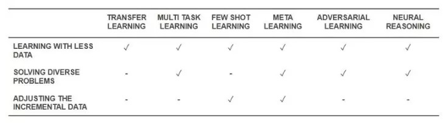
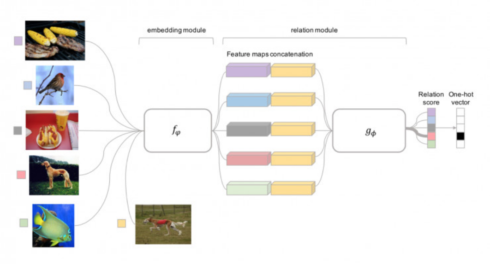
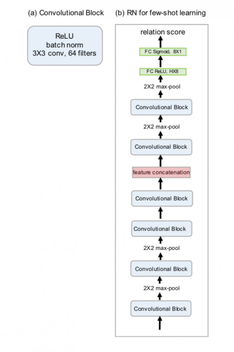
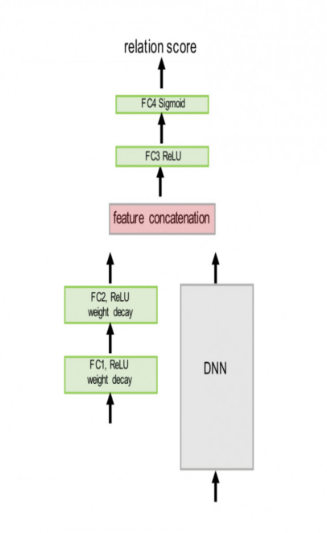
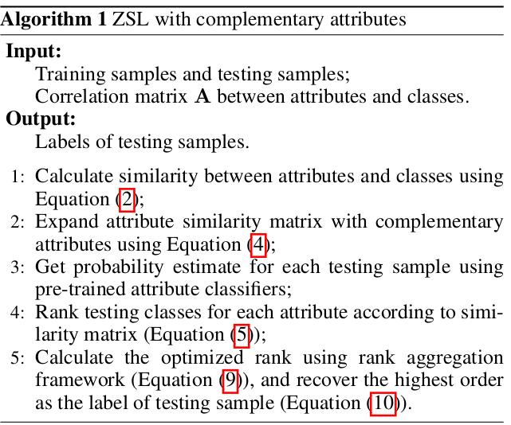
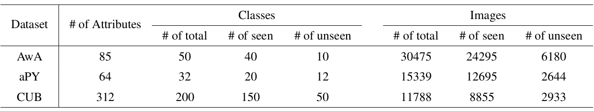
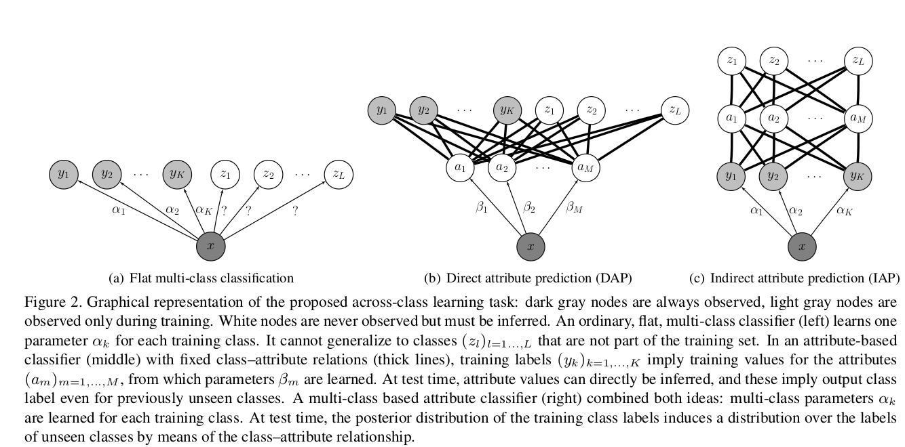

# Zero-shot Learning (零样本学习)

## Discriminative Learning of Latent Features For Zero-Shot Recognition (CVPR2018 Oral)

### Introduction & Overview

* What is ZSL:

    ZSL aims to recognize an object instance from a new category *never seen* before.

    **The task of identifying classes without any observed data is called ZSL.**

    The seen set categories in the training set and the unseen categories in the test set are disjoint.

* Main chanllenge os ZSL

    Generalize the recognition models to identify the novel object categories without accessing any labelled instances of these categories.

* Key idea

    *Explore* & *exploit*  the knowledge of how an unseen class is semantically related to the seen classes.

    *Explore*: uses intermediate-level semantic representations

    *Exploit*: Knowledge transfer between the source and target datasets.

    **Zero-shot recognition is crucial for recognizing dynamically created novel concepts which are composed of new combinations of existing concepts.**

* ZSL - Life-long learning - learning to learn.

## Semantic Representations

* Semantic Attributes

    Attribute learning provides an intuitive mechanism for multi-task learning.

    Particularly, attribute learning enables the learning with few or zero instances of each class via attribute sharing.

    ZSL: knowledge transfer basing on semantic information

    Different types of attributes:

  * User-defined Attributes

  * Relative Attributes

  * Data-driven attributes

  * Video Attributes

* Semantic Representations Beyond Attributes

  * Comcept ontology

  * Semantic word vectors

### Models For Zero-Shot Recognition

The ZSL can be solved by first learning an embedding model, and then doing recognition.

The embedding models aim to establish connections between seen classes and unseen classes by projecting the low-level features of images/videos close to their corresponding semantic vectors.

The recognition model matches the projection of the image features against the unseen class prototypes.

* Embedding Models

  * Bayesian Models:

    * DAP Model

    * IAP Model

  * Semantic Embedding

  * Embedding into Common Spaces

* Recognition Models in the Embedding Space

* Problems in Zero-shot Recognition

    There are two insrinsic problems in ZSR:

  * Projection Domain Shift Problems

    * Transductive learning based approaches

    * Inductive learning base approaches

  * Hubness Problem

### Beyond zero shot recognition

* Open-set Recognition

    *Closed set*: all testing classes should be known at training time.

    *ZSR*: the testing classes and training classes are totally separated.

    *Open Set*: the testing classes include both *seen* & *unseen* classes.

    Open-set recognition, in constrast, has been develped independently of ZSR.

    **The open set recogntion can be roughly divided into two subgroups:**

  * Conventional open set recognition

    Only identifies whether the testing images come from the training classes or some unseen classes.

    不会预测Unseen来自哪个类。

    In such setting, the conventional open set recognition is also known as ***Incremental learning***.

  * Generalized Open set recognition

    The difference from the conventional open set recognition is that the generalized open set recognition also needs to explicitly predict the semantic meaning of testing instance even from the unseen novel classes.

* One-shot or ew-shot learning problem

    Existing one-shot learning approaches can be divided into two groups:

  * Direct Supervised Learning-based Approaches:

  * Transfer Learning-based One-shot Recogniton:

### Future Research Directioins

* More Generalized and Realistic Setting

* Combining Zero-shot with Few-shot Learning

* Beyond Object Categories

* Curriculum learning

### Author Introduce

***Yanwei Fu***:

School of Data Science, FuDan University

## [零样本学习](https://www.leiphone.com/news/201803/f4Yx5IqXUjtayIXd.html)

### 零样本学习

    **本质上，零样本学习属于迁移学习的一种**

### 研究现状

* 2008年，Larochelle等人对字符分类问题提出了零样本学习

* 2009年，Lampert等人提出了Animals with Attributes数据集和经典的基于属性学习的算法，才算真正打开零样本学习的关注度。

* 2013年，NIPS发表的[DeViSE](http://papers.nips.cc/paper/5204-devise-a-deep-visual-semantic-embedding-model.pdf)，解决了如何将已有的图像分类模型应用到训练中未涉及到的图像分类中。

* 2014年，ICLR发表的[CNN+word2vec](https://arxiv.org/pdf/1312.5650.pdf)，使用了更简单的方法，从而保留了整个CNN结构，且不需要Linear Transformation。

* 2015年，ICCV发表的[Objects2actioin](http://openaccess.thecvf.com/content_iccv_2015/papers/Jain_Objects2action_Classifying_and_ICCV_2015_paper.pdf)又将零样本学习学习研究向前推进了一步。

* 最经典的零样本学习方法是Lampert在2009年发表在CVPR2009上的[DAP](https://pdfs.semanticscholar.org/9c35/596de9fd5d31fbb3c119f880d54e92e02333.pdf)提出的直接属性预测模型。

  模型中属性训练是在传统特征提取的基础上，利用颜色直方图、局部自相似直方图、SIFT和PHOG等六种方法来提取样本图像的底层特征，这几种特征包含了图像的颜色、形状和纹理等方面，所以通过这种特征提取方法得到的特征可以良好的表达图像中的信息。

  在得到上述属性特征的基础上，将特征用于属性分类器的训练，然后将训练得出的模型用于属性的预测，最后采用贝叶斯方法推断测试样本的类别。

  近年来，深度特征的使用，大大提高了零样本识别的准确率。

### 零样本学习的潜在应用场景

  零样本学习是希望借助辅助知识(如属性、词向量、文本描述)学习从未讲过的新概念。在一些场景下，如细粒度物体识别、任意语言之间的翻译等，难以获得足够多的有标注数据来训练识别或预测模型的情况。

* 物体识别

  在没有训练样本的情况下，借助辅助知识(如属性、词向量、文本描述)学习一些从未见过的新概念。

* 语言翻译

* 图像合成

  零样本图像合成希望GAN模型能够合成从未见过的类别的图像。目前已有一些算法通过条件GAN网络实现零样本图像合成。

* 图像哈希

  图像哈希算法那利用一些训练样本来学习针对某些类别的哈希算法。但这些学习到的哈希算法无法用于新类别。零样本哈希，希望在已知类别上学习到的哈希算法可以运用到新的未知类型上。目前，一些基于属性的零样本哈希算法已经被提出。

### AI Challenger

[比赛相关信息](https://challenger.ai/competitions)

[数据集下载](https://challenger.ai/datasets)

包含78017张图像，230个类别、359中属性。与ImageNet重合度更低。

卡尔、祈求者： Invoker

## [零样本-付彦伟](http://www.10tiao.com/html/580/201801/2650329595/1.html)

### Overview

### Definition

* One-shot Learning

  属于监督学习，在某个空间(如视觉空间)，根据予以标签训练相应的分类器，因为Training Inference较少，所以称之为One-shot。但是One-shot Learning不能识别从未见过的物体类别。

* Zero-shot Learning

  是为了识别位置类别的样本，其思想是迁移一些已知的辅助类别语义和知识。借助已知的辅助类别样本来学习从视觉空间到语义标签的映射，所有测试样本都会被投影到该语义空间，然后被赋予相应的标签信息，这里的关键是如何选取标签语义。

  不需要样本标签，但是目标类别数目受限;

  一般的语义标签大体可以分为两类：

  * Semantic Attributes(语义属性)

    它具有很好的解释性但需要大量的人工标注。

  * Semantic Word Vectors(语义向量)

    可以从大量文本中训练出来，并不需要人工标注, 并有大量的Free Vocabulary。

* Open-set Recognition

  Attribute Learning识别的未知类别数量一般都不大，可以把这类思想推广到Open-set Recognition， Open-set Recognition就是从大量图片词汇类别中识别图像视频的语义标签。

  不需要标签，有大量的样本库。

### Embedding

Embedding space

* Multimodel Embedding

* Multi-view Embedding

* Pairewise Graph Embedding

  * Subjective Visual Properties

    关系类型的数据标注，可统称为Subjective Visual Properties. 这是更好的语义表示，它的歧义性个呢过小，更有利于迁移学习。

    对于这类数据，我们一般是要做Crowdsourced Paired Comparisons来收集它的标准信息，这里的优势在于，标注起来更节省成本，可以标注大规模的数据集。

  * Robust Learning to Rank

### More

* 视频理解：

  通过深度学习来Embedding目标或者场景，做Action, activity, one-shot learning, zero-shot learning。

* 利用概率图模型自动生成海报

## [元学习](https://www.leiphone.com/news/201803/Q4Rz7i06ngA68v1L.html)

OpenAI新设计的元学习算法Reptile。算法的结构简单，但却可以同时兼顾单个样本和按规模样本的精确学习。

新的元学习(meta-learning)算法Reptile的运作原理是反复对任务采样、在其上运用梯度下降，并从初始参数开始持续地想任务上学到的参数更新。Reptile可以和应用广泛的院学习方法MAML(Model agnostic meta learning)达到同样的表现，同时更易于实现、计算效率更高。

元学习是一个学习“如何学习”的过程。一个元学习算法要面对一组任务，其中每一个任务都是一个学习问题，然后算法会产生一个快速学习器，这个学习期有能力从很小数目的一组样本中泛化。

### Reptile的工作方式

和MAML类似，Reptile首先会为神经网络寻找一组初始化参数，以便网络稍后可以根据来自新任务的数量不多的几个样本进行精细调节(Fine-tune)。不过相比于MAML需要在梯度下降算法的计算图中展开求带，Reptile只需要简单地在每个任务中以标准方法执行随机梯度下降(SGD)，并不需要展开一个计算图以及计算任何二阶导数。节省了计算资源和存储资源。

利用泰勒级数逼近参数更新，Reptile的更新可以让在同一个任务中不同Minibatch的梯度的内积最大化，这就对应了模型的更强的泛化能力。

### 其它

[深度学习趋势](https://36kr.com/p/5108107.html)

有很多方法实现少样本学习，包括迁移学习、多任务学习和元学习。

元学习就像它听起来的那样，是一种可以通过一个数据集，生成一个专门为这个数据集准备的新机器学习算法那。

他们普遍拥有一些属性：

* 系统必须包含一个学习系统，它会根据经验来做适应

* 经验通过利用元知识，要么从之前学习的单个数据集里面获得，要么从不同领域知识获得

* 学习偏差必须动态选择

经典论文：

* Meta-Learning Shared Hierarchies

* Meta-Learning Using Temporal Convolutions

  可以利用元学习构建少样本学习或零样本学习的算法。

* **神经推理**

  可以解决一些困难的问题，包括少样本学习问题等。

* **迁移学习**

  在迁移学习中，学习得到的知识在相同的算法上，从一个任务迁移到另一个任务上的。

## 用于零样本识别的隐含特征鉴别式学习(CVPR2018 Oral)

[Paper](https://arxiv.org/pdf/1803.06731)

### 摘要

零样本学习（ZSL）的目标是通过学习图像表征和语义表征之间的嵌入空间来识别未曾见过的图像类别。多年以来，在已有的研究成果中，这都是学习对齐视觉空间和语义空间的合适映射矩阵的中心任务，而学习用于 ZSL 的鉴别性表征的重要性却被忽视了。在本研究中，我们回顾了已有的方法，并表明了为 ZSL 的视觉和语义实例学习鉴别性表征的必要性。我们提出了一种端到端的网络，能够做到：1）通过一个缩放网络自动发现鉴别性区域；2）在一个为用户定义属性和隐含属性引入的扩增空间中学习鉴别性语义表征。我们提出的方法在两个有挑战性的 ZSL 数据集上进行了大量测试，实验结果表明我们提出的方法的表现显著优于之前最佳的方法。

### 主要算法

## [少样本学习--牛津](https://www.jianshu.com/p/49b02c40000a)

### 论文摘要

  在这篇文章中，作者提出了一个概念上简单、灵活和通用的小样本学习框架，其分类器能识别新的类别，这些类别每个类都只会给出少量的样本。该方法称为关系网络(Relation Net, RN).它能够学会比较，从而实现小样本学习，并且稍加改进，就能够实现从少样本学习到零样本学习。

### 主要内容

随着有区别性的深度学习方法在丰富的多类别的数据集中成功，人们将这种深度学习方法迁移到少样本学习中，其中许多方法使用元学习或从学习到学习的策略，它们从一组辅助任务中提取一些可转移的知识，这样就可以很好的进行少样本学习。少样本学习方法具有：

* 基于Fine Tune

训练时，会固定基础网络部分的参数，对领域特定的网络参数进行训练(这里有很多训练的Trick, 包括如何设置固定层和学习率)。

* RNN Memory Based

利用具有记忆的递归神经网络。通常的想法是，RNN在给定问题上的前一步上迭代并积累知识，关键在于确保它们可靠的存储所有潜在的、长期的、相关的历史信息，而不会忘记。这样的结构会比较复杂。

* 基于度量学习的方法

  这个方法对样本间的距离分布进行建模，使得属于同类样本靠的近，异类样本远离。

* 本文Idea来源

  人类之所以能识别一个新东西，在于人的视觉系统天生的能够对任意物体提取特征，并会和其它物体进行比较。我们能够比较不同的物体，所以我们根本无所谓看到的东西是不是以前见过。这就是我们人具备少样本学习的关键能力，这种比较能力是基于你潜在的很多知识。

  我们希望达到的目的是，当面向新的少样本学习任务时，我们能够充分利用我们已经学习到的识别能力（也就是元知识），来快速实现对新物体的识别。所以我们要研究的就是如何通过元学习的方式来让神经网络学会比较这个元知识能力，于是idea就产生了。

* 模型提出

  我们将该任务定义为小样本分类器学习，将数据集分成 training set、support set和testing set，其中support set和testing set共享相同的label空间，training set有自己的label空间。

  如果support set中有C类物体，每类物体有K个样本，我们称之为C-way K-shot。

  整个关系网络由嵌入模块和关系模块组成，Support set和Testing set都需要经过嵌入模块提取特征，然后将特征联合起来输送到关系模块进行比较，然后我们根据比较的结果(Relation Score)来判断这个测试图片到底属于哪一类。

  

* 公式化表达

  **Relation Score计算公式**

  $$r_{i,j} = g_{\Phi}(C(f_{\varphi}(x_i), f_{\varphi}(x_j))$$

  **损失函数**

  $$ \varphi, \Phi \leftarrow argmin_{\varphi, \Phi}\sum_{i=1}^m\sum_{j=1}^n(r_{i, j}-1(y_i == y_j))^2 $$

  在零样本学习中，给出一个代表某一类物体语义的嵌入式向量，把训练样本(Support Set)改成这个语义嵌入向量就可以来做零样本学习。Relation Score计算公式如下：

  $$r_{i,j} = g_{\Phi}(C(f_{\varphi_1}(v_i), f_{\varphi_2}(x_j))$$

* 网络结构

  * 少样本学习的网络结构

    在输出层增加了Sigmoid得到Score，其它的卷积层加ReLu

    

  * 零样本学习的网络结构

    结构中的DNN是选用在ImageNet上预训练好的网络，如ResNet.

    

* 论文实验

  * 数据集

  少样本学习： Omniglot、Minilmagenet

  零样本学习：AwA, CUB

### 为什么有效

  本文提出的方法可以认为是一种基于度量的方式，也就是使得同类样本靠近，异类样本原理，靠谁近就属于哪一类，和传统人为设计的度量方式(如欧氏距离，余弦距离)不同的是，我们的度量方式是靠网络自己学习的，人为设计的度量方式是有较大缺陷的。

## Zero-shot Learning with Complementary Attributes (2018)

### 论文摘要1

利用属性(Attributes)实现语义信息从训练数据到测试数据的迁移，实现ZSL。

Attributes的好坏决定了ZSL系统的泛化能力。

In this paper, we peopose a novel ZSL method using **complementary attributes** as a supplement to the original attributes. We first expand attributes with their complementary form, and then pre-train classifiers for both original attributes and complementary attributes using training data. After ranking classes for each attribute, we use rank aggregation(聚合) framework to calculate the optimized rank among testing classes of which the highest order is assigned as the label of testing sample.

### ZSL简介

ZSL aims to recognize new objects using disjoint training objects, so some high-level semantic properties of objects are required to transfer information between different domain resources.

Attribute is a typical nameable description of objects. 可以是颜色、形状, it could also be a centain part or a manual descriptio of an object.

Attributes can be binary value for describing the presence or absence of a property for an object, and it can also be continuous value for indicating the correlation between the property and object.

**ZSL usually adopts a two-stage strategy to recognize unseen objects with seen objects given**. In this two-stage model, **attributes classifiers** are pre-trained using seen training data firstly, and then the label of unseen testing data is inferred by combining the outputs of classifiers via attributes relationship.

In order to make all of the attributes useful for ZSL whether it is relevant(1) or irrelevant(0), we introduce *complementary attributes* as a supplement to the original attributes, which are the opposite form of the original attributes.即，Complementary Attributes是Original Attributes的按位取反。

Firstly, Complementary Attributes are introduced and similarityies matrix is calculated to imply the correlation between attributes and objects.

Secondly, ranking testing classes for each attribute

Thirdly, Rank Aggregation framework to calculate the optimized rank among testing data.

Finally, the highest order fo the optimized rank is assigned as the label of testing sample.

### Main Contribution

* We introduce complementary attributes as a supplement to the original attributes;

* We use rank aggregation framework to fuse ranks per attributes

* We conduct experiments on three ZSL datasets, demonstrating that the proposed approach is effective and advanced for ZSL.

### Related works 1

* Semantic Representation

  * DAP

    Categorize Zero-Shot visual objects using attribute-level relationship as the assitant information.

  * ALE (Attribute label embedding, 2016)

    Learns a compatibility function mapping image feature to attribute-based label embedding.

  * Relative attribute 2011

  * Others

    Semantic correlation between high-level property and object description calculated by word2vec model. Knowledge mined from Web, semantic class taxonomies, and class similarities are some other high-level features of prior information used for ZSL.

* ZSL

  * Two-stage stragegy

    * DAP

      Learns probabilistic attribute classifiers using the seen data and infers the labels of unseen data by combining results of pre-trained classifiers.

    * IAP

      induces a distribution over the labels of testing data through the posterior distribution of the seen data by means on the class-attribute relationship.

  * Direct Learns

    Directly learn vairous functions mapping input image features to semantic embedding space.

### 主要思想 1

Traning classes $Y$ and test classes $Z$ are disjoint.

* Complementary Attributes

  The value of attribute indicates the presence or absence of semantic property for a specific object.

  Attribute can be specified either on a per-class level or on a per-image level, and it can also be divied into binary value attribute and continuous value attribute according to the value type.

  Suppose we have K seen classes for training and L unseen classes for testing. Each class has an attributes vector:$a_j=[a_j^1, \ldots, a_j^m]^T$, 其中，$a_j^i$ 表示第j类的第i个属性。

  Attributes Matrix $A$:

  $$A=[a_Y, a_Z]$$

  Similarity matrix $S$, 表示不同类别与属性之间的相关性:

  $$S=[s_{Y_1}, s_{Y_2}, \ldots, s_{Z_L}]$$

  其中，$s_j = a_j / \parallel a_j \parallel_2^2$，且$s_{ij}$表示第j类的第i个属性。

  得到Complementary attribute Similarity matrix:

  $$\bar{S} = 1 - S$$

  最后得到Expanded Attribute similairty matrix:

  $$S = \left[ \frac{S}{\bar{S}} \right]$$

* ZSL Using Rank Aggregation

  Total $M$ attributes, and $M$ corresponding classifiers. 对于属性$a_m$, 分类器可表示为：$p(a_m | x)$

  Different attributes usually have distinct similarities that induce different orderings among testing classes. So we recover a proximal ordering which has least empirical error according to M orderings for each testing sample.

  $$r = \sum_{m=1}^{M}p(a_m | x)r^m$$

  其中，$r^m$为根据第m个属性得到的类别的Ordering; $M$为总的属性的个数，包括Complementary Attributes.

  然而这个式子有以下两个问题：

  * Similarities calculated from artifical continuos attribute values may be not smooth since attributes values may contain some gross outliers.

  * similarities may be not on the same scale hence they cannot be simply averaged.

  所以采用以下方法来处理M个Ordering不同的问题：

  $$C^m = r^m \cdot 1^T - 1 \cdot (r^m)^T$$

  其中，$r^m \in R^L$,其中$L = Y + Z$是总的类别的个数。共有M(属性的个数)个$C^m \in R^{L * L}$

  利用下式求解统一的矩阵$C$:

  $$min_{C, E^m} = \sum_{m=1}^M w_m \parallel C - C^m + E^m \parallel^2  + \lambda \parallel E^m \parallel_1$$

  其中，$w_m$ 为$p(a_m | x)$. $\parallel E^m \parallel$为Error Matrix, 可以利用下式的Huber loss function消去。

  $$min_C \sum_{m=1}^M w_mH_m(C - C^m)$$

  其中，$H(\cdot)$为Huber loss function, 对处理Outliers更鲁棒。

  上式是凸函数，可以利用梯度下降等方法优化。利用求得的结果C，可以恢复Ranking Vector $r$:

  $$r = argmin_r \parallel r \cdot 1^T - 1 \cdot r^T - C \parallel_2^2$$

  其中，排在最前面的类别就是需要测试数据的类别。

* 总的算法

### Experiment

* 用到的数据集

  * AwA

  * aPY

  * CUB

* Confusion Matrix

  即Error Matrix，混淆矩阵。是可视化工具，特别用于监督学习,在无监督学习中一般被称为匹配矩阵。

  矩阵的每一列代表一个类的实例**预测**，每一行代表一个**实际**类的实例。

  **Each row of the matrix represents the instances in a predicted class while each column represents the instances in an actual class (or vice versa).**

* Evaluation protocols

  **Mean class accuracy**, *i.e.* per-class averaged top-1 accuracy is calculated as the criterion of assessment since the dataset is not well balanced with respect to the number of images per class.

* Results analysis

  * Complementary attributes can describe objects more comprehensively and therefore make the semantic embedding space more complete.

  * Rank aggregation framework overcomes the slack assumption of DAP that attributes are independent from each other.

  * The approach is more robust than DAP on zero-shot learning.

### 总结 1

  Attribute is a representative high-level semantic property of objects, and complementary attribute is introduced as a supplement of attribute in this work.

  **TODO**:

* 没说输入中的Attributes Matrix是怎么生成的 !

* Attribute Matrix对ZSL十分重要，所以生成这个矩阵也是重中之重。

## Attribute-based classification for ZS Visual Object Categorization

### 摘要 2

  To recognition the unseen objects, we introduce attribute-based classification: Objects are identified based on a high-level description that is phrased in terms of semantic attributes, such as object's color or shape.

## Learning to Detect Unseen Object Classes by Between-Class Attribute Transfer

### 摘要 3

Study the problem of object classification when training and test classes are disjoint.

In this paper, tackle the problem by introducing attribute-based classification. It performs object detection based on a human-specified high-level description of the target objects instead of training images.

The description consists of arbitrary semantic attributes, like shape, color or even geographic information.

New classes can be detected based on their attribute representation, without the need for a new training phase.

Our experiments show that by using an attribute layer, it is indeed possible to build a learning object detection system that does not require any training images of the target classes.

### Introduction 3

The attributes serve as an intermediate layer in a classifier cascade and they enable the system to detect object classes, for which it had not seen a single training example.

The fact that meaningful high-level concepts *transcend*(超越) class boundaries.

Each attribute can be used for the detection of many object classes that makes our proposed learning method statistically efficient.

### Information Transfer by Attribute Sharing

Basing the intuition that the use of attributes allows us to transfer information between object classes.

Training datas: $X$

Seen classes: $Y$

Unseen Classes: $Z$

In order to make predictions about classes, we need to introduce a coupling between classes in $Y$ and $Z$.

Since no training data for the unobserved classes is available, this coupling cannot be learned from samples, but has to be inserted into the sytem by human effort. This introduces two severe constraints on what kind of coupling mechanisms are feasible:

* The amount of human effort to specify new classes should be minimal

* Coupling data that requires only common knowledge is preferable over specifalized expert knowledge, becasue the latter is often difficult and expensive to obtain.

### Attribute-Based Classification

  The attributes are assigned on a per-class basis instead of a per-image basis, the manual effort to add a new object class is kept minimal.

  

  Two generic methods to integrate attributes into multi-class classification:

* DAP(Direct Attribute Prediction)

  See Fig 2.(b).

  Uses an in between layer of attribute variables to decouple the images from the layer of labels.

  During the training, the output class label of each sample induces a deterministic labeling of the attribute layer.

* IPA(Indirect Attribute Prediction)

  See Fig 2.(c).

  Also uses attributes to transfer knowledge between classes, but the attributes form a connecting layer between two layers of labels.

  The training phase if ordinary multi-class classification.

  The testing phase, the predictions for all training classes induce a labeling of the attribute layer, from which a labeling over the test classes can be inferred.

  This can introduce a bias, if training classes are also potential output classes during testing.

  Deriving the attribute layer from the label layer instead of from the samples will act as regularization step that create only sensible attribute combinations and therefore makes the system more robust.

### Implementaion of DAP/IAP

Use a probabilistic model that reflects the graphical structures of DAP/IAP.

All attributes are assumed to have binary values.

* DAP

  Start by learning probabilistic classifiers for each attribute $a_m$.

  The trained classifiers provide us with estimates of $p(a_m|x)$, from wich we form a model for the *complete image-attribute layer* as:

  $$p(a|x) = ...$$

  上面是一个判别模型。

  *As attribute-class layer* 有以下关系

  $$p(z|a)$$

  综合上面两层，我们可以得到概率分布(属性层类似于隐含层)：

  $$p(z|x)$$

  文章中，假设属性$a_m$之间是相互独立的。

  Use MAP to prediction.

* IAP

  To implement IAP, we only modify the image-attribute stage.

  Inferring the attribute posterior probabilities: $p(a_m|x)$

  $$p(a_m|x) = \sum_{k=1}^Kp(a_m|y_k)p(y_k|x)$$

### Connections to Previous Work

* Sharing Information between Classes

A common idea is to construct multi-class classifiers in a cascaded way.

* Learning Semantic Attributes

Building block for attribute-based classification is the *learning of high level semantic attributes* from images.

A related line of research studies how the human performance in object detection tasks depends on the presence or absence of object properties and contextual cues.

### Dataset: Animals with Attributes

This datasets is a existing class-attribute association data, which was collected from cognitive science research.

### Experimental Evaluation

For DAP, we train a non-linear support vector machine(SVM) to predict each binary attributes.

### Conclusion 3

Better designed per-attribute and multi-class classifiers could improve the overall performance of the system, as could a per-attribute feature selection set, because clearly not alll attributes relevant for a human can be determined from images.

It should be possible to increase the attribute set without retraining.

Building an automatic system to label the image classes with the attribute valuses, possibly using textual information from the internet. Ultimately, this could even lead to a fully automatic determination of both, the attributes and their values.

A different interesting direction for future work, is the
question how attribute-based classification and supervised
classification can be merged to improve the classification
accuracy when training examples are available but scarce.
This would make attribute-based classification applicable to
existing transfer learning problems with many classes, but
few examples per class.
